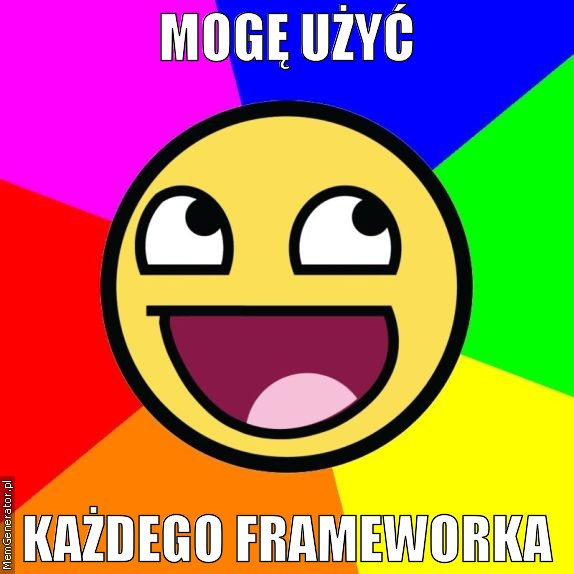
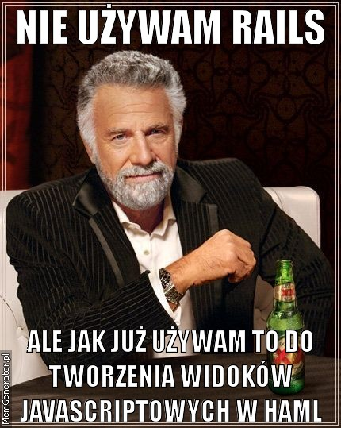
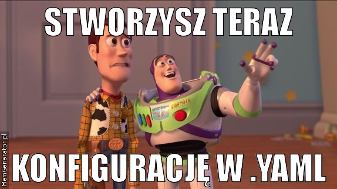

!SLIDE 
# Backbone – jak zmusić Haml do współpracy #

!SLIDE bullets incremental
# Tak naprawdę #

* Zadziała z każdym innym frameworkiem .js

!SLIDE center

!SLIDE
# Czego potrzebujemy? #

!SLIDE
    @@@ ruby
    # Gemfile
    gem 'rails'

!SLIDE center

!SLIDE
    @@@ ruby
    # Gemfile
    gem 'rails' # ;-)
    gem 'haml'

!SLIDE center

!SLIDE bullets incremental smaller
## "git://github.com/software-project/jammit.git" ####

    @@@ ruby
    # Gemfile
    gem 'rails' # ;-)
    gem 'haml'
    gem "jammit"

!SLIDE
# Do jammita potrzebna jest konfiguracja #

!SLIDE center

!SLIDE
    @@@ ruby
    assets: on
    javascript_compressor: yui
    package_assets: off
    template_function: _.template

!SLIDE
# Fork jammita używa underscore template'ów #

!SLIDE center

!SLIDE
# Musimy jeszcze rozszerzyc nasz helper #

!SLIDE smaller
    @@@ ruby
    def jst_templates(dir = Rails.root.to_s)
     result = []
     Find.find(dir + "/app/views/") do |partial|
      if partial =~ /.jst.haml/
       result << partial.gsub(/\/_/,"/")
                        .gsub(/(.*)\/app\/views\//,'')
                        .gsub('.haml', '')
      end
     end
     result
    end

!SLIDE smaller
    @@@ ruby
    def template_tag template
    text = (render :partial => template)
    new_line = ""
    body = text.gsub(/".html_safe

!SLIDE
# Otrzymamy #

!SLIDE
    @@@ javascript
    

!SLIDE
# Czas na hamlowo javascriptowe hello world ;-) #

!SLIDE
    @@@ ruby
    # _example.jst.haml
    .hello
      .world
        = link_to "hello world", '#'

!SLIDE smaller
    @@@ javascript
     

!SLIDE bullets incremental
# Co możemy użyć? #
* formtastic
* simple form
* helpery
* haml

!SLIDE
# Jak to połączyć z javascript? #

!SLIDE
# each #

!SLIDE
    @@@ ruby
    :each
      collection: tabs
      item: tab
    .test.div_class
      %p
        Paragraph text:
        :js # tagowanie w <% %>
          = tab.get('body')
    :endeach

!SLIDE
# if #

!SLIDE
    @@@ ruby
    :if
      condition
    .class
      %p
        Other haml content goes here.
    :end

!SLIDE
# else #

!SLIDE
    @@@ ruby
    :if
      condition
    Other haml tags goes here
    :else
    Other haml tags goes here
    :end

!SLIDE
# wstawianie wartości #

!SLIDE
    @@@ ruby
    :js
      = model.get('value')

!SLIDE
# Przykład #

!SLIDE
    @@@ ruby
    :if
      collection.length > 0
    .user-list
      :each
        collection: collection
        item: user
      .user
        :js
          = user.get('username')
      :endeach
    :else
    .user-list
      .user
        = t(:sorry_no_users)
    :end

!SLIDE center

!SLIDE bullets incremental smaller
# Problemy #

* Mieszanie hamla z javascript (pod tagiem :js znika magia)
* Używanie \_.template w parametrach haml 
* .class{:"data-user-id" => js("model.get('user_id')"}
* Nieraz tagi trzeba dodać ręcznie bo nie tryka ;-)
* Ogólnie problemy są do rozwiązania
* Fork fork fork -- commit commit commit

!SLIDE center

