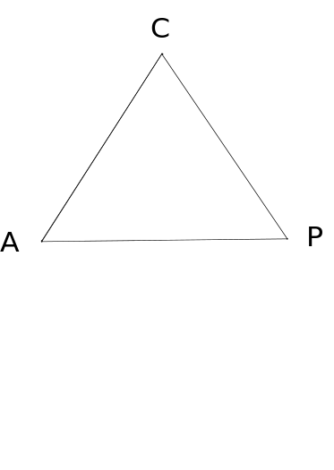
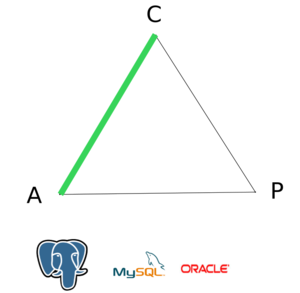
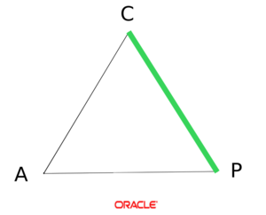
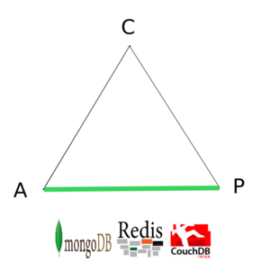
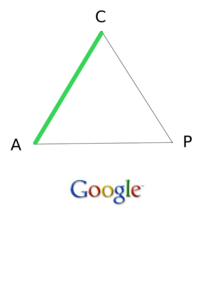
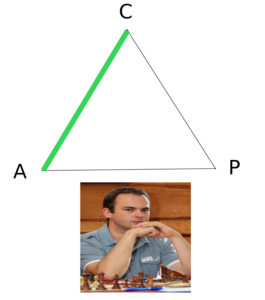
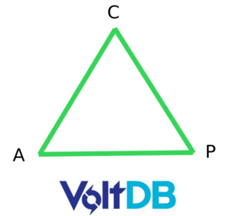
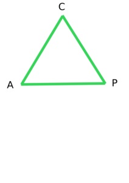
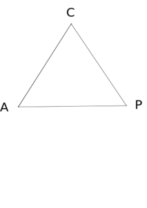
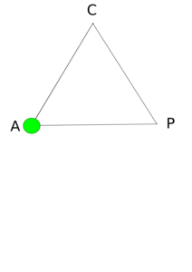

!SLIDE
# ACID #
## is not a dirty word ##
## @mlomnicki ##

!SLIDE
<h1 class="off">ACID</h1>
<h2 class="off"> Respect your data</h2>
## @mlomnicki ##

!SLIDE
# CAP Theorem #
## The art of choice ##
## @mlomnicki ##

!SLIDE bullets cap
# CAP Theorem #
## by Eric Brewer in 2000 ##
## Proven in 2002 by Seth Gilbert & Nancy Linch ##

!SLIDE bullets incremental cap fl
# CAP Theorem #
* Consistency
* Availability
* Partition tolerance
* At most 2 of 3 properties may be satisfied

!SLIDE center
# CAP Theorem #

!SLIDE center
## RDBMS (single-site and cluster) ##
<h3 class="on">Consistency</h3>
<h3 class="on">Availability</h3>
<h3 class="off">Partition tolerance</h3>

!SLIDE center
## Distributed RDBMS ##
<h3 class="on">Consistency</h3>
<h3 class="off">Availability</h3>
<h3 class="on">Partition tolerance</h3>

!SLIDE center
## NoSQL ##
<h3 class="off">Consistency</h3>
<h3 class="on">Availability</h3>
<h3 class="on">Partition tolerance</h3>

#### ...also DNS is AP ####

!SLIDE center
## BigTable ##
<h3 class="on">Consistency</h3>
<h3 class="on">Availability</h3>
<h3 class="off">Partition tolerance</h3>

#### P is on GFS side ####

!SLIDE center
## Prevayler/Madeleine ##
<h3 class="on">Consistency</h3>
<h3 class="on">Availability</h3>
<h3 class="off">Partition tolerance</h3>

!SLIDE center
## NewSQL ##
<h3 class="on">Consistency</h3>
<h3 class="on">Availability</h3>
<h3 class="on">Partition tolerance</h3>

#### Impossible according to the theory ####
#### ...but Stonebraker doesn't agree ####

!SLIDE center
# Real life stories #

!SLIDE center
# What you think you have #

!SLIDE center
# What you really have #

!SLIDE center
# ..to be fair #

!SLIDE bullets acid smaller
# The art of choice #
* Scalability over Consistency
* Consistency over Scalability

!SLIDE bullets acid smaller
# Forfeit Partition Tolerance #
* Consistent system - easy
* High Availability - hard
* known & proven HA workarounds
* Facebook - MySQL + memcache
* Vertical scalability

!SLIDE bullets acid smaller
# Forfeit Consistency #
* High Availability
* Horizontal scalability - better
* "Eventually consistent" (BASE)
* HA = race conditions
* workarounds?

!SLIDE bullets acid smaller
# What you need #
* Extremely efficient
* Reliable (in data sense)

!SLIDE bullets fl acid
# ACID #
* Atomicity
* Consistency
* Isolation
* Durability

!SLIDE bullets fl acid
# BASE #
* Basically Available
* Soft state
* Eventual consistency

!SLIDE bullets acid smaller
# ACID #
* people don't care
* ...but think data is consistent anyway
* you can't enforce consistency at ActiveRecord level

!SLIDE bullets smaller acid
# BASE #
* consistency relaxed
* to make horizontal scalability easier
* inconsistencies handled by developer

!SLIDE bullets smaller acid
# beware of vendors #
* they don't always tell the truth
* NoSQL is never ACID-compilant
* NoSQL - lack of atomic operations across documents/collections
* Prevayler - poor isolation
* HBase - poor durability

!SLIDE bullets acid smaller
# SQL is ACID #
* except MySQL with MyISAM
* MVCC over locking
* but must follow the rules
* foreign keys, unique indexes
* transaction isolation levels

!SLIDE
# Links #
* [CAP preso](http://www.cs.berkeley.edu/~brewer/cs262b-2004/PODC-keynote.pdf)
* [CAP proof](http://citeseerx.ist.psu.edu/viewdoc/download?doi=10.1.1.20.1495&rep=rep1&type=pdf)
* [CAP explained](http://pl.atyp.us/wordpress/?p=2521)
* [CAP and NoSQL](http://www.andrewjonascarter.com/files/ResearchPaper_Databases.pdf)
* [Comparision](http://javathink.blogspot.com/2010/01/characterizing-enterprise-systems-using.html)
* [Stonbraker on CAP](http://voltdb.com/company/blog/clarifications-cap-theorem-and-data-related-errors)
* [Sharding limits](http://www.mongodb.org/display/DOCS/Sharding+Limits)
* [more on CAP](http://codahale.com/you-cant-sacrifice-partition-tolerance/)

!SLIDE
# Questions? #

