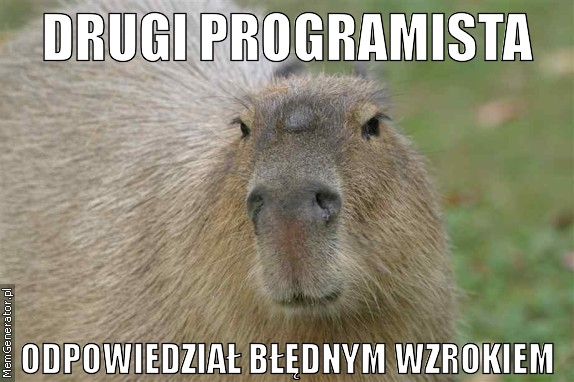
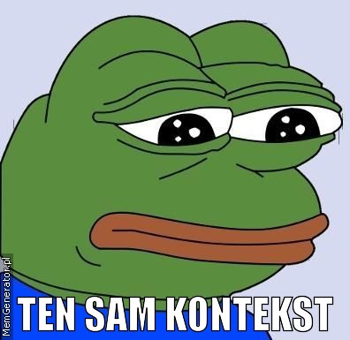

!SLIDE 
# Modyfikowalny proc #

!SLIDE 
# Spotkało się dwóch programistów #

!SLIDE
# Jeden do drugiego powiedział #

!SLIDE
# Wiesz co? Chyba nie da się modyfikować Proc'a #

!SLIDE center

!SLIDE
# I zaczął rozszerzać #

!SLIDE bullets incremental
## Jaki chciał uzyskać efekt? ##
* Wykonać coś przed lub po procu, ale w jego kontekście

!SLIDE
    @@@ ruby
    class Proc
      alias :old_initialize :initialize
      alias :old_call :call
    end

!SLIDE center

!SLIDE incremental bullets
# Pierwszy problem #
* Jak zachować kontekts

!SLIDE smaller
    @@@ ruby
    class C
      def self.get_proc
        var = "proc from C"
        proc {puts var}
      end
    end

    var = "proc normal"
    proc{ puts var }.call # => "proc normal"
    C.get_proc.call # => "proc from C"

!SLIDE center

!SLIDE
# Ratuje nas funkcja binding #

!SLIDE
    @@@ ruby
      Proc.binding # => Binding

!SLIDE
    @@@ ruby
      Proc.binding # => Binding
      Binding.eval

!SLIDE
# Jak ktoś nie lubi evali #
    @@@ ruby
    class Binding
      alias :safe_eval :eval
    end

!SLIDE center

!SLIDE
# Funkcja eval może jako drugi argument przyjmować binding #

!SLIDE bullets incremental
# Drugi problem #
* Które zmienne podmienić?

!SLIDE smaller
    @@@ ruby
    def call(*args)
      variables = 
      eval("local_variables+instance_variables", 
            self.binding)

      old_call(*args)
    end

!SLIDE
# Dodamy prostą funkcję << #

!SLIDE
    @@@ ruby
    class Proc
      def <<(other)
        if other.is_a? Proc
          @before << other
       else
         raise Exception
       end
      end
    end

!SLIDE smaller
    @@@ ruby
    def call(*args)
      variables = 
      eval("local_variables+instance_variables", 
            self.binding)
      @before.each do |proc_to_bind|
        variables.each do |var|
          # Tutaj mamy obiekt, który możemy przypisać
          var_to_bind = self.binding.eval("#{var}")
          eval("#{var} = #{var_to_bind}", 
                proc_to_bind.binding) # ??????
        end
      end

      old_call(*args)
    end

!SLIDE center

!SLIDE bullets incremental
# Jest rozwiązanie! #
* lambda ;-)

!SLIDE smaller
    @@@ ruby
    def call(*args)
      variables = 
      eval("local_variables+instance_variables", 
            self.binding)
      @before.each do |proc_to_bind|
        variables.each do |var|
          # Tutaj mamy obiekt, który możemy przypisać
          var_to_bind = self.binding.eval("#{var}")
          eval("lambda { |v| #{var} = v }",
          proc_to_bind.binding).call(var_to_bind)
        end
      end

      old_call(*args)
    end

!SLIDE center

!SLIDE smaller
    @@@ ruby
    class MeineKleineKlasse 
      attr_accessor :another_proc
      def initialize
        var = "another_proc"
        @another_proc = proc{puts var}
      end
    end
    var = "normal_proc"
    normal_proc   = proc{puts var}
    another_proc  = MeineKleineKlasse.new.another_proc
    normal_proc << another_proc
    normal_proc.call

    # OUTPUT
    # "normal_proc"
    # "normal_proc"

!SLIDE
# Q & A #

