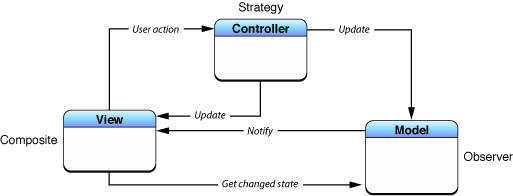
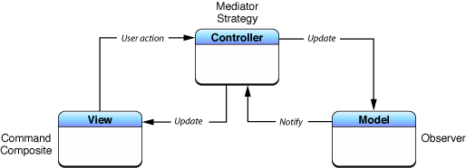

!SLIDE
# Ember.js #
## mlomnicki ##

!SLIDE
# Ember.js #
## mlomnicki ##
<h2 style="text-decoration: line-through">the andrzejkrzywda way</h2>

!SLIDE
# formerly Sproutcore 2.0 #

!SLIDE
# Eliminate boilerplate #

!SLIDE

# Handlebars #

* needed to fully utilize Ember.js

!SLIDE

* Bindings
* Computed properties
* Auto-updating templates

!SLIDE
# Code! #

!SLIDE center
## Traditional/Smalltalk MVC ##

!SLIDE center
## Cocoa MVC ##

!SLIDE
## Good parts ##

* bindings
* strong core team (yehuda, tom dale, drogus)

!SLIDE
## Bad parts ##

* get/set everywhere
* custom objects
* average support for CS

!SLIDE
## QA ##
