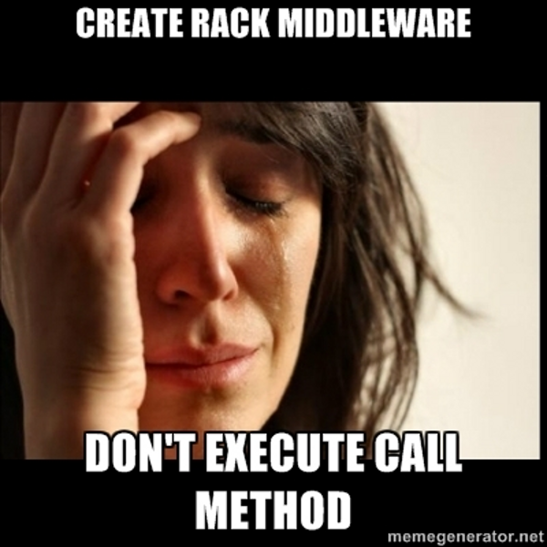

!SLIDE 
# Grape internals #

!SLIDE
# Rack #

!SLIDE
# What is this? #

!SLIDE smaller center
# Rack is a standardized frame or enclosure for mounting multiple equipment modules #

!SLIDE smaller center
# Rack is a standardized frame or enclosure for mounting multiple equipment modules #

!SLIDE smaller center
## The rack is a torture device consisting of a rectangular, usually wooden frame ##

!SLIDE smaller center
## The rack is a torture device consisting of a rectangular, usually wooden frame ##

!SLIDE center

!SLIDE center

!SLIDE
## Rack provides a minimal interface between webservers supporting Ruby and Ruby frameworks. ##

!SLIDE
## Rack provides a minimal interface between webservers supporting Ruby and Ruby frameworks. ##

!SLIDE
# Interface #

!SLIDE
# Super simple! #
      @@@ruby
        class RackApplication
          def call(env)
            [200, {}, ["Hello world!"]]
          end
        end

!SLIDE
# Rack #
      @@@ruby
        class RackApplication
          def call(env)
            [200, {}, ["Hello world!"]]
          end
        end

# Muzang #
      @@@ruby
        class MuzangPlugin
          def call(connection, message)
            # stuff
          end
        end

!SLIDE center

!SLIDE
# .call method - nice trick! #

!SLIDE smaller
      @@@ruby
        class RackApplication
          def call(env)
            [200, {}, ["Hello world"]]
          end
        end

        RackApplication.new.call #=> [200, {}, ["Hello world"]]

        p = Proc.new { |env| [200, {}, ["Hello world"]] }
        p # has call method :)
        p.call # => [200, {}, ["Hello world"]]

!SLIDE center small
# So... proc can also be rack application #

!SLIDE
# Application vs. Middleware #

!SLIDE small
## Middleware should accept instance of next aaplication or middleware as first argument of constructor ##

    @@@ruby
      class RackMiddleware
        def initialize(app)
          @app = app
        end
        
        def call(env)
          # stuff here
          @app.call(env)
        end
      end

!SLIDE
# How middleware works? #

!SLIDE
      @@@ruby
        use RackMiddleware
        run RackApplication

!SLIDE smaller
    @@@ruby
      use RackMiddleware
      # @use << proc { |app| RackMiddleware.new app }
      run RackApplication

!SLIDE smaller
    @@@ruby
      use RackMiddleware
      # --------------
       @use << proc { |app| RackMiddleware.new app }
       @use #=> [ proc { |app| RackMiddleware.new app } ]
      # --------------

      run RackApplication
      # --------------
       @app #=> <RackApplication:0x000000023ef2e0>
       @use.reverse.inject(@app) do |app, mid| 
          mid.call(app)
       end.call(REQUEST)
      # --------------

!SLIDE smaller
      @@@ruby
        
        class RackMiddleware1
          def initialize(app); @app = app; end
          end

          def call(env); @app.call(env); end
        end
    
        use RackMiddleware1
        use RackMiddleware2
        use RackMiddleware3
        use RackMiddleware4
      
        run RackApplication

        @r4 = RackMiddleware4.new(RackApplication)
        @r3 = RackMiddleware3.new(@r4)
        @r2 = RackMiddleware2.new(@r3)
        @r1 = RackMiddleware1.new(@r2)

        @r1.call("REQUEST")
        # fire @r1.call method

!SLIDE center

!SLIDE
# Grape #

!SLIDE
      @@@ruby
        class My::API < Grape::API
        end

!SLIDE
## Nice DSL ##
      @@@ruby
        class My::API < Grape::API
          version 'v1'
         
          resource :status do
            # GET /status/current
            get :current do
              "my current status"
            end

            # POST /status/current
            post :current do
              params[:current_status]
            end
          end
        end

!SLIDE 
# What really happened? #
        @@@ruby
            # GET /status/current
            get :current do
              "my current status"
            end

!SLIDE smaller
      @@@ruby
        class Grape::API
          class << self
            def get(paths = ['/'], options = {}, &block)
              route('GET', paths, options, &block)  
            end
        end

!SLIDE smaller
# Grape::Endpoint #
      @@@ruby
        class Grape::API
          class << self
            def get(paths = ['/'], options = {}, &block)
              route('GET', paths, options, &block)  
            end

            def route(met, paths, route_options = {}, &block)
              endpoint_options = {
                :method => methods,
                :path => paths,
                :route_options => (route_options || {})
              }
              endpoints << Grape::Endpoint.new(settings.clone, 
                                               endpoint_options, 
                                               &block)
            end
        end

!SLIDE smaller
      @@@ruby
        class Grape::Endpoint
          def initialize(settings, options = {}, &block)
            @settings = settings
            @block    = block # create in My::API scope
            @options  = options
          end
        end

!SLIDE
# So we have the endpoint, this is our rack application? #

!SLIDE center smaller

!SLIDE
      @@@ruby
        class Grape::Endpoint
          def call(env)
            dup.call!(env)
          end
        end

!SLIDE
      @@@ruby
      class Grape::Endpoint
       def call(env)
        dup.call!(env)
       end

       def call!(env)
        # ... 
        builder = build_middleware
        builder.run lambda{|env|self.run(env)}
        builder.call(env)
       end
      end

!SLIDE
      @@@ruby
        def build_middleware
          b = Rack::Builder.new
          b.use Grape::Middleware::Error
          b.use Rack::Auth::Basic
          b.use Rack::Auth::Digest::MD5
          b.use Grape::Middleware::Prefixer
          b.use Grape::Middleware::Versioner
          b.use Grape::Middleware::Formatter

          b
        end

!SLIDE smaller
      @@@ruby
      def run(env)
        @request = Rack::Request.new(@env)

        self.extend helpers
        run_filters befores
        response_text = instance_eval &self.block
        run_filters afters

        [status, header, [body || response_text]]
      end

!SLIDE bullets incremental
# Flow #

* Create block in Grape::API context
* Send block to Grape::Endpoint
* Execute block in new context

!SLIDE center

!SLIDE center smaller
# No render method :( #

!SLIDE
# Rabl! #
## RABL (Ruby API Builder Language) ##

!SLIDE small
      @@@ruby
      # notices/index.rabl
      collection @notices => :notice
      attributes :name, :id

      # [ { "notice":{"name":"Name", "id":"ID"}},
      #   { "notice":{"name":"Name2", "id":"ID2"}} ]
!SLIDE
# Sinatra #
      @@@ruby
        get "/v1/errors/:error_id/notices" do
          @notices = error.notices
          render(:rabl, "notices/index")
        end

!SLIDE
# How to use rabl in grape? #

!SLIDE smaller
      @@@ruby
        # Gemfile
        gem 'grape-rabl'

        # config.ru
        require 'grape/rabl'

        class My::API < Grape::API
          get "/notices", :rabl => "notices/index" do
            @notices = error.notices
          end
        end

!SLIDE
# How it works? #

!SLIDE smaller
      @@@ruby
        def build_middleware
          b = Rack::Builder.new
          b.use Grape::Middleware::Error
          b.use Rack::Auth::Basic
          b.use Rack::Auth::Digest::MD5
          b.use Grape::Middleware::Prefixer
          b.use Grape::Middleware::Versioner
          b.use Grape::Middleware::Formatter # <- !!!!oneone

          b
        end

!SLIDE smaller
      @@@ruby
      module Grape
        module Middleware
          class Formatter
            alias :old_after :after
            
            def after
              current_endpoint = env['api.endpoint']
              engine = ::Tilt.new(view_path(template))
              engine.render(current_endpoint, {})
              Rack::Response.new(rendered, status, headers).to_a
            end
          end
        end
      end

!SLIDE smaller
# Why endpoint? # Magic #

      @@@ruby
      vars = @scope.instance_variables
      vars.each { |name| 
        instance_variable_set(name, 
                              object.instance_variable_get(name)) 
      }

      def method_missing(name, *args, &block)
        if @scope.respond_to?(name) 
          @scope.send(name, *args, &block)
        else
          super
        end
      end

!SLIDE
# Why grape? #
## Because of Yoda ##

!SLIDE center

!SLIDE
# #basedonmyobversation #

!SLIDE center
### ab -c 10 -n 10000 http://localhost:4567/test ###

!SLIDE center

