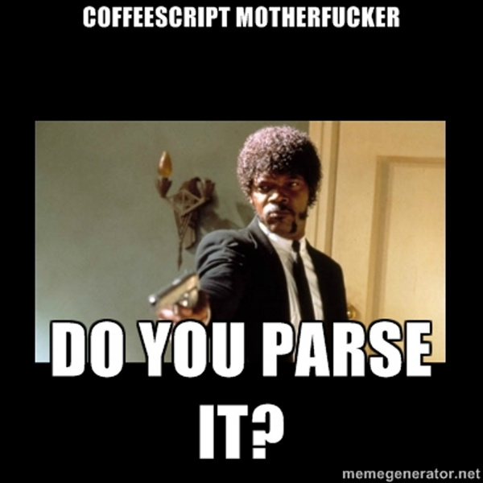

!SLIDE 
# Playing with Ruby syntax  #
## Piotr Niełacny

!SLIDE
# Coffeescript constructor #

      @@@ coffeescript
      Class Coffee
        constructor: (@name) ->
      end

!SLIDE smaller
# In ruby? #

      @@@ruby
        class Coffee
          def initialize(name = nil)
            @name = name
          end
        end

        Coffee.new
        # => #<Coffe:0x00000001315d20 @name=nil>

        Coffee.new("DRUG")
        # => #<Coffe:0x00000001315d20 @name="DRUG">

!SLIDE center

!SLIDE
# Better syntax! #

      @@@ruby
        class Coffee
          def initialize(@name); end
        end

!SLIDE
# Let's compile! #

!SLIDE center

!SLIDE
A syntax error has occurred:
formal argument cannot be an instance variable

!SLIDE center

!SLIDE center
#### formal argument cannot be an instance variable

!SLIDE center
### formal argument cannot be an instance variable

!SLIDE center
## formal argument cannot be an instance variable

!SLIDE center
# formal argument cannot be an instance variable

!SLIDE center

!SLIDE center
# grep! #

!SLIDE
    @@@c
    | tIVAR
    {
    yy_error("formal argument cannot be an
              instance variable");
    $$ = 0;
    }

!SLIDE center

!SLIDE
    @@@c
    | tIVAR
    {
      $$ = 0;
    }

!SLIDE smaller
      @@@ruby
        class Coffee
          attr_accessor :name
          def initialize(@name); end
        end

        Coffee.new.name => nil
        Coffee.new("DRUG").name
        # => method 'initialize': given 1, 
        #                         expected 0 (ArgumentError)

!SLIDE center

!SLIDE
# What about AST? #

      @@@ruby
      "def initialize(@name); end".to_ast

!SLIDE smaller
      @@@ruby
      #<Rubinius::AST::Define:0x184ec 
        @arguments=
          #<Rubinius::AST::FormalArguments19:0x184f0 
            @line=1 
            @defaults=nil 
            @splat=nil 
            @names=[] 
            @optional=[] 
            @required=[]> 
        @body=
          #<Rubinius::AST::Block:0x184f8 
            @array=[
              #<Rubinius::AST::NilLiteral:0x18500 @line=1>
            ] 
        @locals=nil> 
        @name=:initialize>

!SLIDE smaller
      @@@ruby
      "def initialize(name = nil); end".to_ast

!SLIDE smaller
      @@@ruby
      @defaults=
        #<Rubinius::AST::DefaultArguments:0x33450
          @names=[:name]
          @line=1
          @arguments=[
            #<Rubinius::AST::LocalVariableAssignment:0x3345c
              @line=1
              @variable=nil
              @name=:name
              @value=#<Rubinius::AST::NilLiteral:0x33460 @line=1>>
          ]>
          @splat=nil
          @names=[:name]
          @block_arg=nil
          @splat_index=nil 
          @optional=[:name] 
          @required=[]>

!SLIDE smaller
# FormalArguments19 #

      @@@ruby
      class FormalArguments19 < FormalArguments
        def initialize(line, required, optional, splat, post, block)
          if optional
            @defaults = DefaultArguments.new line, optional
            @optional = @defaults.names
            names.concat @optional
          else
            @optional = []
          end
        end
      end

!SLIDE
# But... #
## def method(@name) == def method(name)

!SLIDE smaller
# FormalArguments19 #

      @@@ruby
      class FormalArguments19 < FormalArguments
        def initialize(line, required, optional, splat, post, block)
          required.inspect => [false]

          if optional
            @defaults = DefaultArguments.new line, optional
            @optional = @defaults.names
            names.concat @optional
          else
            @optional = []
          end
        end
      end

!SLIDE center

!SLIDE center

!SLIDE
    @@@c
    | tIVAR
    {
    yy_error("formal argument cannot be an
              instance variable");
    $$ = $1;
    }

!SLIDE smaller
# FormalArguments19 #

      @@@ruby
      class FormalArguments19 < FormalArguments
        def initialize(line, required, optional, splat, post, block)
          required.inspect => [:@name]

          if optional
            @defaults = DefaultArguments.new line, optional
            @optional = @defaults.names
            names.concat @optional
          else
            @optional = []
          end
        end
      end

!SLIDE 
      @@@ruby
        if arg.to_s =~ /^@/
          defaults << arg.to_s[1..-1].to_sym
        end

!SLIDE
# All required ^@ => optional! #

!SLIDE
# Empty method

      @@@ruby
      class Block
        if block.array.empty?
          block.array << NilLiteral.new(line)
        end
      end

!SLIDE smaller
# Custom empty method?;)

      @@@ruby
      def initialize(@name) # => @name = name

      if @arguments.default_variables
       @arguments.defaults.names.each do |arg_name|
        block.array.unshift(
          InstanceVariableAssignment.new(
           line, 
           "@#{arg_name}".to_sym, 
           LocalVariableAccess.new(line, arg_name)))
        end
      elsif block.array.empty?
        block.array << NilLiteral.new(line)
      end

!SLIDE
# Demo

!SLIDE
# Q & A
